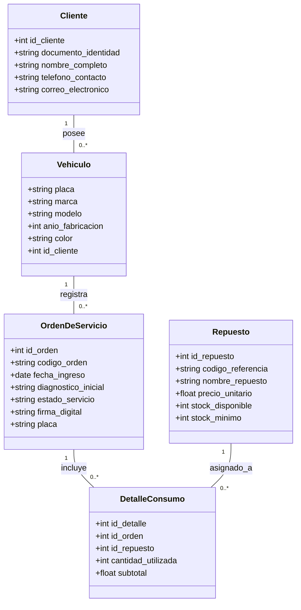

# AutoGestion
# AutoGestión - Sistema de Gestión para Taller Automotriz

## Modelo del Dominio (FPI-09)

```mermaid
classDiagram
    class Cliente {
        +int id_cliente
        +string documento_identidad
        +string nombre_completo
        +string telefono_contacto
        +string correo_electronico
    }

    class Vehiculo {
        +string placa
        +string marca
        +string modelo
        +int anio_fabricacion
        +string color
        +int id_cliente
    }

    class OrdenDeServicio {
        +int id_orden
        +string codigo_orden
        +date fecha_ingreso
        +string diagnostico_inicial
        +string estado_servicio
        +string firma_digital
        +string placa
    }

    class DetalleConsumo {
        +int id_detalle
        +int id_orden
        +int id_repuesto
        +int cantidad_utilizada
        +float subtotal
    }

    class Repuesto {
        +int id_repuesto
        +string codigo_referencia
        +string nombre_repuesto
        +float precio_unitario
        +int stock_disponible
        +int stock_minimo
    }

    Cliente "1" -- "0..*" Vehiculo : posee
    Vehiculo "1" -- "0..*" OrdenDeServicio : registra
    OrdenDeServicio "1" -- "0..*" DetalleConsumo : incluye
    Repuesto "1" -- "0..*" DetalleConsumo : asignado_a
```
