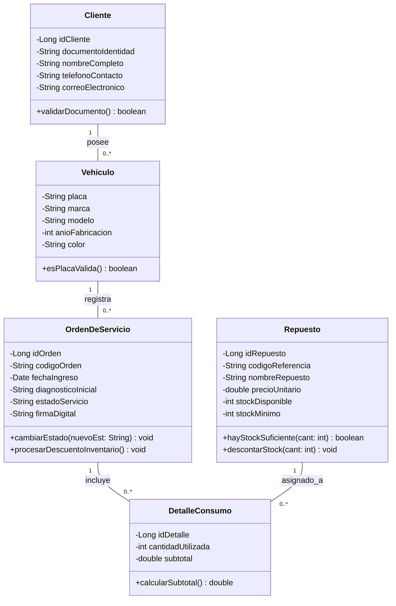
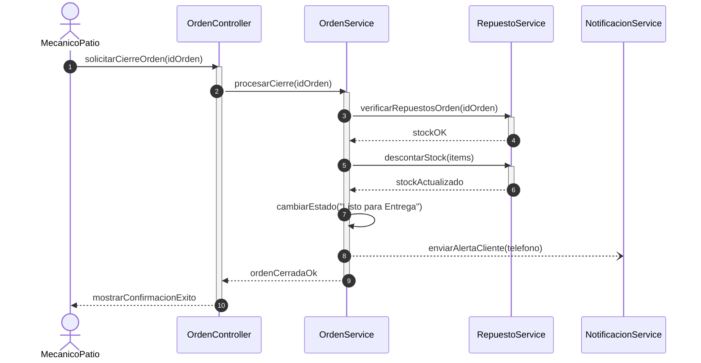

## Diagrama de Clases de Diseño (FPI-10 - Punto 2)

```mermaid
classDiagram
    class Cliente {
        -Long idCliente
        -String documentoIdentidad
        -String nombreCompleto
        -String telefonoContacto
        -String correoElectronico
        +validarDocumento() boolean
    }

    class Vehiculo {
        -String placa
        -String marca
        -String modelo
        -int anioFabricacion
        -String color
        +esPlacaValida() boolean
    }

    class OrdenDeServicio {
        -Long idOrden
        -String codigoOrden
        -Date fechaIngreso
        -String diagnosticoInicial
        -String estadoServicio
        -String firmaDigital
        +cambiarEstado(nuevoEst: String) void
        +procesarDescuentoInventario() void
    }

    class DetalleConsumo {
        -Long idDetalle
        -int cantidadUtilizada
        -double subtotal
        +calcularSubtotal() double
    }

    class Repuesto {
        -Long idRepuesto
        -String codigoReferencia
        -String nombreRepuesto
        -double precioUnitario
        -int stockDisponible
        -int stockMinimo
        +hayStockSuficiente(cant: int) boolean
        +descontarStock(cant: int) void
    }

    Cliente "1" -- "0..*" Vehiculo : posee
    Vehiculo "1" -- "0..*" OrdenDeServicio : registra
    OrdenDeServicio "1" -- "0..*" DetalleConsumo : incluye
    Repuesto "1" -- "0..*" DetalleConsumo : asignado_a
```

## Diagrama de Secuencia del Flujo Crítico (FPI-10 - Punto 3)

```mermaid
sequenceDiagram
    autonumber
    actor M as MecanicoPatio
    participant OC as OrdenController
    participant OS as OrdenService
    participant RS as RepuestoService
    participant NS as NotificacionService

    M->>OC: solicitarCierreOrden(idOrden)
    activate OC
    OC->>OS: procesarCierre(idOrden)
    activate OS
    OS->>RS: verificarRepuestosOrden(idOrden)
    activate RS
    RS-->>OS: stockOK
    deactivate RS
    OS->>RS: descontarStock(items)
    activate RS
    RS-->>OS: stockActualizado
    deactivate RS
    OS->>OS: cambiarEstado("Listo para Entrega")
    OS--)NS: enviarAlertaCliente(telefono)
    OS-->>OC: ordenCerradaOk
    deactivate OS
    OC-->>M: mostrarConfirmacionExito
    deactivate OC
```
